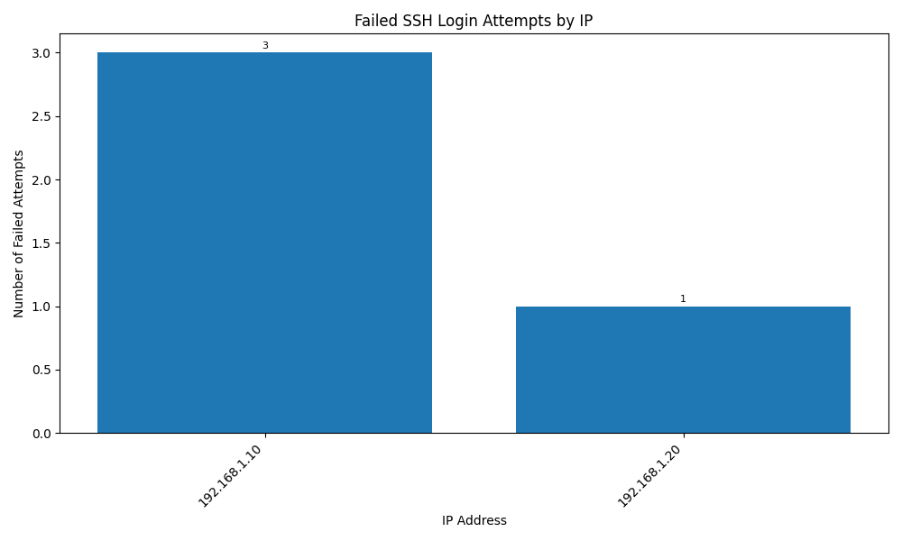

# 🕵️‍♂️ Log File Analyzer

A simple Python tool to scan Linux-style authentication logs and summarize failed SSH login attempts by IP address.

---

## 🚀 Features

- ✅ Parses `auth.log` or similar files
- ✅ Counts failed login attempts by IP
- ✅ Exports results to CSV
- ✅ Visualizes attempts with a bar chart
- 🔜 Planned: JSON export, timestamp analysis, real-time alerts

---

## 📂 Sample Log Format

```bash
Jun 20 10:01:23 server sshd[12345]: Failed password for invalid user testuser from 192.168.1.10 port 54321 ssh2
```
---
## How to Use

1. Clone the repo and install dependencies

```bash
pip install -r requirements.txt
```
2. Run the analyzer
```bash
python3 analyzer.py
```
3. Export the results to CSV:
```bash
python3 analyzer.py --export
```
4. Visualize failed logins as a bar chart
```bash
python3 analyzer.py --plot
```
The plot will be saved as `failed_logins_char.png` and displayed in a pop-up
---
## Example Output Chart


---

## Requirements
- Python 3.9+
- pandas
- matplotlib

---

## Contributions
Feel free to fork and suggest features like:
- Brute force detection
- IP geolocation
- Real-time monitoring

## Author
Built with ❤️ by DaBurgermeista
Inspired by real-world blue team needs.